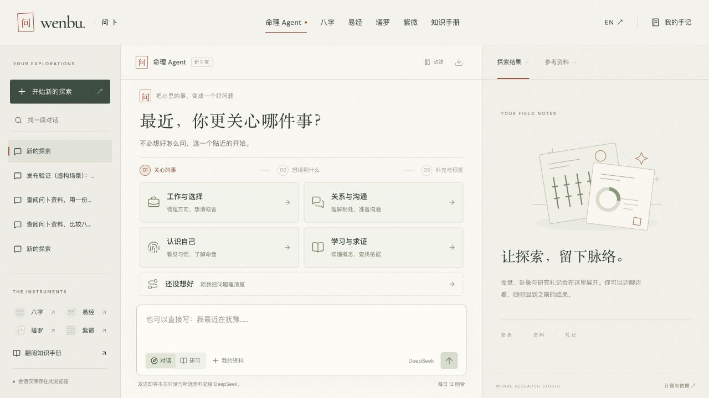

# Agent 提问引导上线记录

2026-09-29（上海时间）。线上入口：[命理 Agent](https://wenbu.genedai.me/agent/)。点击“开始新的探索”可进入引导；已打开的旧页面需要刷新以载入新版。

## 交付行为

- 五个生活意图入口 → 与主题相关的目标 → 选填背景、探索方式与提问预览。支持返回、跳过、直接输入，中英文均可用。
- 默认先聊；用户选择排盘才按需补充出生资料，八字未知时刻保持未知，紫微说明必需参数。选择卡片本身不触发模型调用。
- 所有引导、澄清、报告追问先放入可编辑草稿，保留用户自己输入的文字。换选项仅替换记录的插入范围；改写或清空后同步清除选中状态。
- DeepSeek 面对模糊问题提供一个聚焦问题与 2–4 个选项；补充后尽量直接处理，示例请求不再追加选择示例场景的问卷。完成后的追问优先采用报告自带问题，已经举例时提供整理清单的入口。
- 引导埋点与管理后台汇总上线，只记录步骤、入口类型和模式，不记录主题、选项原文、背景、出生资料或对话内容。

研究、方案取舍与来源见 [设计记录](../plans/2026-09-29-agent-guidance-design.md)，统计口径见 [analytics.md](../analytics.md)。

## 质量验证

| 层次         | 证据                                                                                                                                                                                                                                                                |
| ------------ | ------------------------------------------------------------------------------------------------------------------------------------------------------------------------------------------------------------------------------------------------------------------- |
| 本地工程     | Astro / Worker 类型检查 0 errors / warnings / hints；139 tests / 11 files；ESLint、生产构建通过。69 HTML、64 可索引页面、3193 个内部引用通过审计；原有 78 张牌、牌背和缩略图审计通过。                                                                              |
| 本地浏览器   | 中文桌面与 390×700；320 px 中文/英文无横向溢出；五个首屏选项在 390 px 可见；键盘切换及重新打开引导聚焦当前题目，2 px 可见轮廓；减少动效为 quiet / animation none；后退保留探索方式。                                                                                |
| 可编辑性     | 已有输入包含相同选项文字时，选择、切换回答不会改动原句；新增引导和选择澄清均确认 0 次自动 Agent 请求；只有发送才发起回合。                                                                                                                                          |
| 本地模型     | [两轮真实 DeepSeek 记录](agent-guidance-local.json)：第一轮 ask_user + 4 个选项、waiting；第二轮直接示范、complete，未抽牌或排盘。                                                                                                                                  |
| Grok         | [第一轮](agent-guidance-review.md)发现字符串替换缺陷；[第二轮](agent-guidance-fixes-review.md)发现完成态标题与重开焦点问题。均修复；[最终审查](agent-guidance-final-review.md)返回 **No blocking defects found.** 原始输出本地保留，未把 CLI 退出码等同于审查通过。 |
| 源码 CI      | 实现提交 `f8571e79d7fa03d776d349e75ac3f412c75f449f` 已推送，[Quality run 36475871692](https://github.com/Digidai/wenbu/actions/runs/36475871692) success。后续证据提交不修改应用源码。                                                                              |
| Cloudflare   | Worker version `68a6327d-55c0-4967-9307-33c1476f9bb9`，自定义域名与现有触发器部署成功。                                                                                                                                                                             |
| 线上资源     | [JS 与全部页面样式表字节一致性](agent-guidance-assets-live.json)，线上 SSR 含新入口文字。                                                                                                                                                                           |
| 线上回归     | [74 页面、四种计算 API、MCP 官方客户端验证](agent-guidance-site-live.json)全部通过。                                                                                                                                                                                |
| 线上模型     | [真实两轮 DeepSeek 记录](agent-guidance-live.json)：waiting → complete，每轮 1 model call；请求 deepseek-v4-flash，服务回执 deepseek-flash；第一轮 4 个选项，第二轮无额外澄清、无新牌阵/命盘。                                                                      |
| 线上完整交互 | 浏览器从“工作与选择”到目标、背景、草稿、发送，返回实际的四个澄清选项；点击选项没有调用 Agent，清空草稿后选中状态同步清除。所有场景均明确为虚构验收数据。                                                                                                            |
| 统计回执     | [本地](agent-guidance-analytics-local.json)及[生产](agent-guidance-analytics-live.json)均查询到真实引导记录；本次生产测试在 test=true 中包含开始、步骤 2/3、生成草稿、实际发送及澄清选择，默认报表未纳入这些测试事件。                                              |

第一次模型试用曾对“举个假设例子”继续追问场景。强化避免澄清循环的提示后，用独立的同类两轮用例分别验证本地与生产通过；这不是对所有模型输出的保证。

第一轮 Grok 对 flex 自动 margin 的说明不符合实际分配规则，未据此机械改动布局；桌面与窄屏均以实际渲染检查为准。其余可复现问题均修复。

## 线上截图

- [390 px 手机首屏](agent-guidance-mobile.png)
- [真实 DeepSeek 澄清卡片](agent-guidance-clarification.png)

## 边界

这是已部署的产品交互及代表性用例验证，尚无 A/B 实验或长期使用数据，不能据此宣称转化率、表达准确率、预测准确率或流量已提升。没有新增收费服务、第三方追踪脚本或采集私密问题的统计字段。GTM、收录与流量结果不属于本次验收结果。
