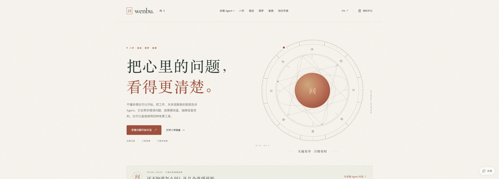

# wenbu.app primary-domain migration — 2026-09-30

## Status

**Live:** [https://wenbu.app](https://wenbu.app). Namecheap nameservers were saved as `buck.ns.cloudflare.com` and `maya.ns.cloudflare.com`; registry RDAP and Google DNS confirmed the pair. The Cloudflare zone became active at **2026-09-30 15:03:06 UTC**. Both apex and www passed trusted HTTPS checks before redirects were enabled. Cloudflare Always Use HTTPS is enabled and verified with real HTTP requests.

[PR #1](https://github.com/Digidai/wenbu/pull/1) merged as **341e9ebf2e54b22906ef13b04bd9b60656a80a32**. [Main-branch Quality CI](https://github.com/Digidai/wenbu/actions/runs/36733639429) passed. Worker version **a154be89-876b-45b3-abec-b233cfa3f7df** now receives **100%** of production traffic, confirmed through the Cloudflare deployment API. Deployment ID: `7107ddfa-cb34-43c5-a751-698620497807`.

The existing Worker, D1/R2 storage, quotas and secrets are retained. The separate `wenbu.ai` zone and unrelated local documentation drafts were left unchanged. No database migration, credential rotation or archive replacement was performed.

## Shipped changes

- Canonical/hreflang/JSON-LD/OG URLs, sitemap/robots/RSS, source citations, MCP/CLI/Skills/OpenAPI/schema links, documentation and operational scripts use `https://wenbu.app`.
- Legacy page paths and query strings are preserved in permanent redirects; `www` normalizes to the apex. Legacy `/api/*` and `/mcp` remain functional for existing native clients and open tabs. Primary and localhost origins do not redirect.
- Old exported context schema identifiers remain accepted. Old/new domains count as internal referrers, without grouping other `genedai.me` projects or lookalike hosts.
- Chinese/English `/move/` pages let people explicitly copy journal and Agent history between the two first-party windows. Exact origin and popup-source checks restrict messages. Source records are retained; existing destination IDs win; storage failures roll back; capacity overflow rejects instead of truncating. Analytics opt-out transfers; visitor IDs and admin credentials do not. History stays between browser windows and is not sent to a backend or a model.
- Recovery pages are noindex, omitted from sitemap and do not initialize analytics or feedback. Script/style/font/image delivery stays on direct asset routing.

## Validation

- `npm run verify`: **188 tests passed**, type checks passed, 91 pages built, 4,578 internal references checked, 84 indexable pages, 78 tarot cards and related assets validated.
- `npm run lint`: passed.
- Local Wrangler smoke: 94 page/resource checks, all four calculation APIs, six MCP tools, bilingual library reads and invalid-request protections passed. No paid model request was made.
- Domain tests cover path/query preservation, method-preserving redirects, Worker dispatch order, old API compatibility, redirect-disable guard, cross-origin message rejection, destination conflict handling, analytics preference preservation, storage rollback and no silent truncation.
- Local browser checks: English desktop and Chinese/English at 390px. English mobile scroll width equals viewport width (390px). These are layout checks, **not a completed production cross-origin transfer test**.
- Production smoke: **94 page/resource checks**, four calculation APIs, six MCP tools, bilingual library reads and invalid-request protections passed at `https://wenbu.app`.
- Production domain checks: **12 redirects**, 15 SEO/resource assertions and eight compatibility assertions passed. The 84 sitemap URLs use the new origin; representative Chinese/English canonical URLs and public integrations do too. Legacy deep links preserve their path/query; www normalizes to apex; HTTP upgrades to HTTPS. Both new and legacy same-origin calculation and MCP requests remain valid.
- Production browser: the new homepage and both migration-origin pages render successfully. New-origin history stayed empty and old-origin records remained present. The existing profile contains user conversations, so no real history was copied or overwritten for testing. A populated cross-origin transfer still needs a separate isolated browser test; unit tests cover merge, rollback and message validation.
- Grok CLI was invoked with a read-only review prompt and timed out after 120 seconds. **No Grok verdict is claimed.**

[Cloudflare binding and DNS state](domain-migration-2026-09-30/cloudflare-state.json) · [Version upload](domain-migration-2026-09-30/version-upload.txt) · [Local verification](domain-migration-2026-09-30/verification.txt) · [Local smoke](domain-migration-2026-09-30/local-smoke.json) · [Grok status](domain-migration-2026-09-30/grok-review.txt)

## Production evidence and remaining verification

[Production deployment](domain-migration-2026-09-30/live-deployment.json) · [Deployment log](domain-migration-2026-09-30/deployment.txt) · [Production smoke](domain-migration-2026-09-30/live-smoke.json) · [Domain/SEO/compatibility checks](domain-migration-2026-09-30/live-domain-checks.json)

Domain binding and the production cutover are complete. The populated history-transfer flow has unit coverage and production UI checks, but an isolated end-to-end browser copy is not claimed. No Search Console submission, change-of-address submission, indexing, ranking or traffic result is claimed by this release.

Rollback, if required, is to deploy the preceding Worker version `a981f577-74d8-412d-91ad-e2c4ad2dab3a`, which restores its matching old-origin assets and configuration. Domain bindings and records can stay in place. Do not change only `SITE_URL` while leaving mismatched static canonicals deployed.

Official references: [Cloudflare Custom Domains](https://developers.cloudflare.com/workers/configuration/routing/custom-domains/), [Worker domain API](https://developers.cloudflare.com/api/resources/workers/subresources/domains/methods/update/).

## Production and layout evidence

