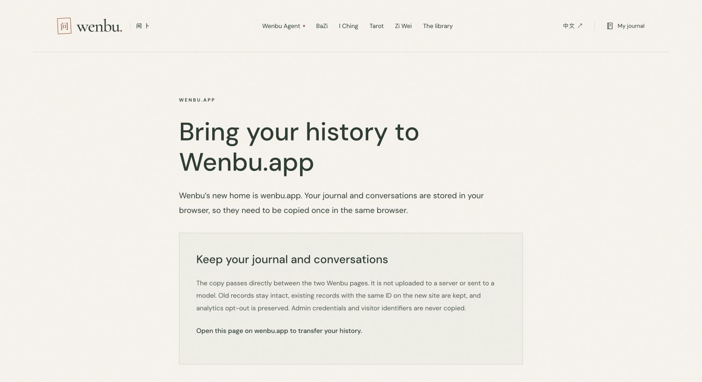
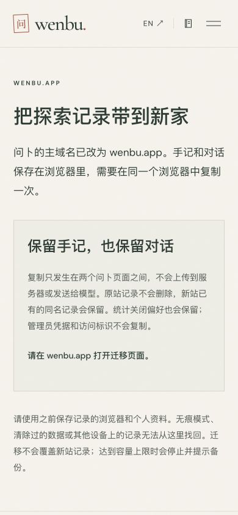
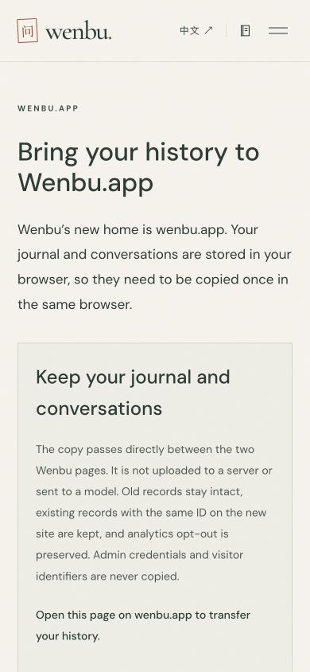

# wenbu.app primary-domain migration — 2026-09-30

## Status

Implementation and local validation are complete. Cloudflare Free zone `wenbu.app` was added to Gene Dai Account, and `wenbu.app` plus `www.wenbu.app` were attached to the existing `wenbu` Worker. The old hostname remains attached. Zone activation is **pending**, because the registrar still advertises `aaden.ns.cloudflare.com` and `dayana.ns.cloudflare.com`; the assigned pair for this zone is **buck.ns.cloudflare.com** and **maya.ns.cloudflare.com**. The separate existing `wenbu.ai` zone was left unchanged.

Version **a154be89-876b-45b3-abec-b233cfa3f7df** was uploaded, **not activated for production traffic**. The previous production version continues to serve the old site. Changing public canonicals and redirecting visitors before the new origin resolves would break the current site, so that cutover remains gated on DNS and TLS verification. No database migration, secret rotation, quota reset or archive replacement was performed.

## Changes prepared

- Canonical/hreflang/JSON-LD/OG URLs, sitemap/robots/RSS, source citations, MCP/CLI/Skills/OpenAPI/schema links, documentation and operational scripts use `https://wenbu.app`.
- Legacy page paths and query strings are preserved in permanent redirects; `www` normalizes to the apex. Legacy `/api/*` and `/mcp` remain functional for existing native clients and open tabs. Primary and localhost origins do not redirect.
- Old exported context schema identifiers remain accepted. Old/new domains count as internal referrers, without grouping other `genedai.me` projects or lookalike hosts.
- Chinese/English `/move/` pages let people explicitly copy journal and Agent history between the two first-party windows. Exact origin and popup-source checks restrict messages. Source records are retained; existing destination IDs win; storage failures roll back; capacity overflow rejects instead of truncating. Analytics opt-out transfers; visitor IDs and admin credentials do not. History stays between browser windows and is not sent to a backend or a model.
- Recovery pages are noindex, omitted from sitemap and do not initialize analytics or feedback. Script/style/font/image delivery stays on direct asset routing.

## Validation

- `npm run verify`: **188 tests passed**, type checks passed, 91 pages built, 4,578 internal references checked, 84 indexable pages, 78 tarot cards and related assets validated.
- `npm run lint`: passed.
- Local Wrangler smoke: 94 page/resource checks, all four calculation APIs, six MCP tools, bilingual library reads and invalid-request protections passed. No paid model request was made.
- Domain tests cover path/query preservation, method-preserving redirects, Worker dispatch order, old API compatibility, redirect-disable guard, cross-origin message rejection, destination conflict handling, analytics preference preservation, storage rollback and no silent truncation.
- Local browser checks: English desktop and Chinese/English at 390px. English mobile scroll width equals viewport width (390px). These are layout checks, **not a completed production cross-origin transfer test**.
- Grok CLI was invoked with a read-only review prompt and timed out after 120 seconds. **No Grok verdict is claimed.**

[Cloudflare binding and DNS state](domain-migration-2026-09-30/cloudflare-state.json) · [Version upload](domain-migration-2026-09-30/version-upload.txt) · [Local verification](domain-migration-2026-09-30/verification.txt) · [Local smoke](domain-migration-2026-09-30/local-smoke.json) · [Grok status](domain-migration-2026-09-30/grok-review.txt)

## Complete the cutover

1. Namecheap → wenbu.app → Nameservers → Custom DNS: replace the current pair with `buck.ns.cloudflare.com` and `maya.ns.cloudflare.com`.
2. Confirm the Cloudflare zone is active and both bound hostnames have working DNS and trusted HTTPS. Do not bypass certificate errors or activate redirects while the new origin is unreachable.
3. Merge the reviewed source and activate the uploaded version at 100% using Wrangler. Confirm the three custom-domain bindings and existing cron remain intact.
4. Verify the new origin’s pages, canonical/hreflang/structured data, robots/sitemap/feeds, API origin protection, MCP and CLI; verify legacy deep-link redirects, www normalization and old API compatibility. Run a synthetic browser-history transfer in an isolated test profile before claiming that flow production-verified.
5. Submit the new sitemap and any search-property change of address only when verified properties are available. No Search Console submission, indexing, rank or traffic result is claimed by this release.

Official references: [Cloudflare Custom Domains](https://developers.cloudflare.com/workers/configuration/routing/custom-domains/), [Worker domain API](https://developers.cloudflare.com/api/resources/workers/subresources/domains/methods/update/).

## Layout evidence

